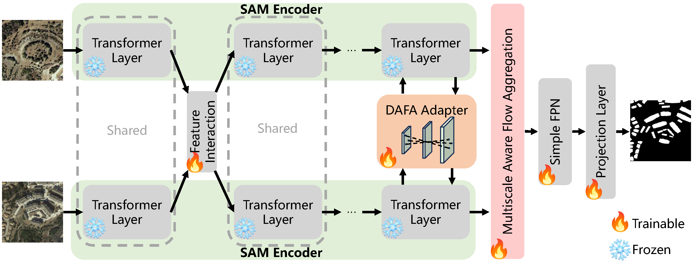
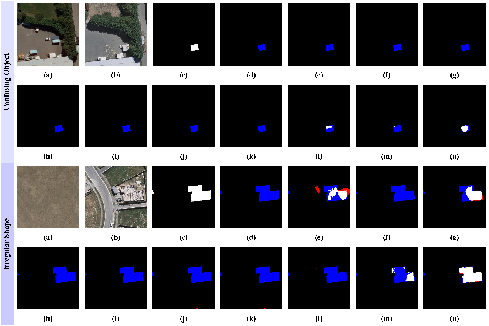

# FAEWNet
This is a PyTorch implementation of the paper SAM-Based Building Change Detection with Distribution-Aware Fourier Adaptation and Edge-Constrained Warping



## simple usage
```
pip install -U openmim
mim install mmengine
mim install "mmcv>=2.0.0"
mim install "mmpretrain>=1.0.0rc7"
pip install "mmsegmentation>=1.0.0rc6"
pip install "mmdet>=3.0.0"
cd  FAEWNet-main
pip install -v -e .
pip install peft
```

## Dataset preparation
```
      Data
      ├── LEVIR-CD
      │   ├── train
      │   │   ├── A
      │   │   ├── B
      │   │   ├── label
      │   ├── val
      │   │   ├── A
      │   │   ├── B
      │   │   ├── label
      │   ├── test
      │   │   ├── A
      │   │   ├── B
      │   │   ├── label
      │   ├── list
      │   │   ├── train.txt
      │   │   ├── val.txt
      │   │   ├── test.txt
```
## Train
```
python tools/train.py configs/faewnet/faewnet_vit-sam-l_512x512_fp16-719e_levircd.py --work-dir ./faewnet_levircd

python tools/train.py configs/faewnet/faewnet_vit-sam-l_512x512_fp16-80k_s2looking.py --work-dir ./faewnet_s2looking

python tools/train.py configs/faewnet/faewnet_vit-sam-l_256x256_fp16-100e_whucd.py --work-dir ./faewnet_whucd
```

## Infer
```
python tools/test.py configs/faewnet/faewnet_vit-sam-l_512x512_fp16-719e_levircd.py faewnet_levircd/best_mIoU_epoch_595.pth 

python tools/test.py configs/faewnet/faewnet_vit-sam-l_512x512_fp16-80k_s2looking.py faewnet_s2looking/best_mIoU_iter_72000.pth

python tools/test.py configs/faewnet/faewnet_vit-sam-l_256x256_fp16-100e_whucd.py faewnet_whucd/best_mIoU_epoch_80.pth 
```
## Results
Visual comparison of building change results on the WHU-CD dataset.


(a) T1 image, (b) T2 image, (c) Change label, (d) ChangerAD (ResNet18), (e) Changer (ResNet18), (f) IDA-SiamNet (ResNet18), (g) BiT, (h) ChangeFormer, (i) ChangerAD (MiT-b1), (j) Changer (MiT-b1), (k) IDA-SiamNet (MiT-b1), (l) BAN, (m) TTP and (n) FAEWNet. True positive is indicated in white, true negative in black, false positive in red, and false negative in blue.
## Pretrained Models

For readers to easily evaluate the accuracy, we provide the trained weights of the FAEWNet

[Baidu](https://pan.baidu.com/s/1Ff6AlKuN9uC3IfFJCg366g) (pswd: 8jih)

## Citation

If you find this project useful in your research, please consider cite:

```bibtex
@ARTICLE{11227013,
  author={Li, Yun-Cheng and Lei, Sen and Zhao, Yi-Tao and Li, Heng-Chao and Li, Jun and Plaza, Antonio},
  journal={IEEE Transactions on Geoscience and Remote Sensing}, 
  title={SAM-Based Building Change Detection With Distribution-Aware Fourier Adaptation and Edge-Constrained Warping}, 
  year={2025},
  volume={63},
  number={},
  pages={1-14},
  doi={10.1109/TGRS.2025.3629110}}
```
